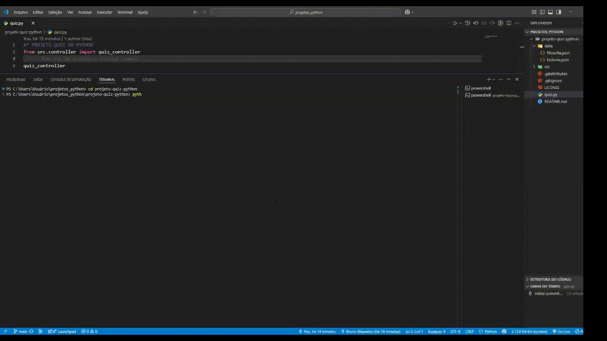

# Quiz Interativo em Python 🐍

## 📖 Sobre o Projeto

Este projeto consiste em uma aplicação de quiz interativo que roda no terminal (CLI). O que começou como um simples exercício de programação em Python evoluiu para uma aplicação robusta e modular, com o objetivo de aplicar e demonstrar conceitos de arquitetura de software, boas práticas de codificação e gerenciamento de projetos.

O quiz permite que o usuário escolha entre diferentes matérias (como Filosofia e História) e teste seus conhecimentos, recebendo feedback imediato e uma pontuação final. O projeto foi estruturado para ser facilmente escalável, permitindo a adição de novas matérias e perguntas sem a necessidade de alterar o código-fonte principal.

## 🎥 Demonstração


## ✨ Funcionalidades Principais

- **Quiz por Matérias:** O usuário pode escolher qual matéria deseja responder.
- **Menus Dinâmicos:** O menu de matérias é gerado automaticamente com base nos arquivos de perguntas disponíveis, tornando o sistema escalável.
- **Interface Interativa no Terminal:** Experiência de uso clara e guiada diretamente no console.
- **Feedback Imediato:** O sistema informa se a resposta está correta ou incorreta na hora.
- **Pontuação Final:** Ao final de cada quiz, um resumo detalhado do desempenho é exibido.

## 🏛️ Arquitetura e Boas Práticas

A construção deste projeto foi guiada por princípios de software que visam a qualidade, manutenibilidade e escalabilidade do código.

### Arquitetura MVC (Model-View-Controller)

- **Model (`src/model`):** Responsável por toda a lógica de dados, como carregar as perguntas dos arquivos JSON e processar as respostas e a pontuação.
- **Controller/View (`src/controller`):** Responsável por interagir com o usuário, exibir os menus, capturar as respostas e controlar o fluxo da aplicação.

Essa separação de responsabilidades torna o código mais organizado, mais fácil de testar e de dar manutenção.

### Dados Externalizados (JSON)

Todas as perguntas, alternativas e respostas são armazenadas em arquivos `.json` na pasta `data/`. Essa abordagem desacopla os dados da lógica da aplicação, permitindo que qualquer pessoa adicione novas matérias e perguntas facilmente.

### Código Robusto e Seguro

- **Tratamento de Exceções:** Uso de blocos `try-except` para lidar com entradas inválidas do usuário (`ValueError`) e arquivos não encontrados (`FileNotFoundError`), prevenindo que a aplicação quebre inesperadamente.
- **Caminhos de Arquivo Portáveis:** Uso de `os.path.join` e `os.path.abspath` para garantir que o programa encontre os arquivos de dados, independentemente do sistema operacional (Windows, Mac ou Linux).

## 🛠️ Tecnologias Utilizadas

- **Linguagem:** Python 3

### Módulos da Biblioteca Padrão

- `json`: Para serialização e desserialização dos dados das perguntas.
- `os`: Para manipulação de caminhos de arquivos de forma robusta.

### Ferramentas de Organização

- **Trello:** Utilizado para o gerenciamento ágil do projeto, com um backlog de funcionalidades e organização em sprints de desenvolvimento.

## 🚀 Como Executar o Projeto

Para executar o projeto localmente, siga os passos abaixo:

### Clone o repositório:

```bash
git clone https://github.com/SEU_USUARIO/NOME_DO_REPOSITORIO.git
```

### Navegue até a pasta do projeto:

```bash
cd NOME_DO_REPOSITORIO
```

### Execute o script principal:

```bash
python quiz.py
```

## 🧩 Como Adicionar Novas Matérias

A arquitetura do projeto permite adicionar novas matérias de forma muito simples:

1. Vá até a pasta `data/`.
2. Crie um novo arquivo com o nome da matéria, seguindo o padrão `.json` (ex: `geografia.json`).
3. Dentro do arquivo, siga a estrutura de lista de dicionários abaixo:

```json
[
    {
        "enunciado": "Texto da pergunta, seguido do comando da questão...",
        "alternativas": {
            "A": "Texto da alternativa A.",
            "B": "Texto da alternativa B.",
            "C": "Texto da alternativa C.",
            "D": "Texto da alternativa D."
        },
        "resposta": "C"
    }
]
```

## 🎯 Próximos Passos

O desenvolvimento deste projeto é contínuo. As próximas funcionalidades planejadas são:

[ ] Suporte a Sub-temas: Permitir que uma matéria tenha categorias internas.

[ ] Randomização: Embaralhar a ordem das perguntas e/ou das alternativas a cada jogo.

[ ] Sistema de Ranking: Salvar as pontuações em um arquivo para criar um ranking de jogadores.

[ ] Testes Unitários: Implementar testes para garantir a estabilidade do código.

## 👨‍💻 Autor
Bruno Alejandro

LinkedIn: https://www.linkedin.com/in/brunoalejandrodev/
